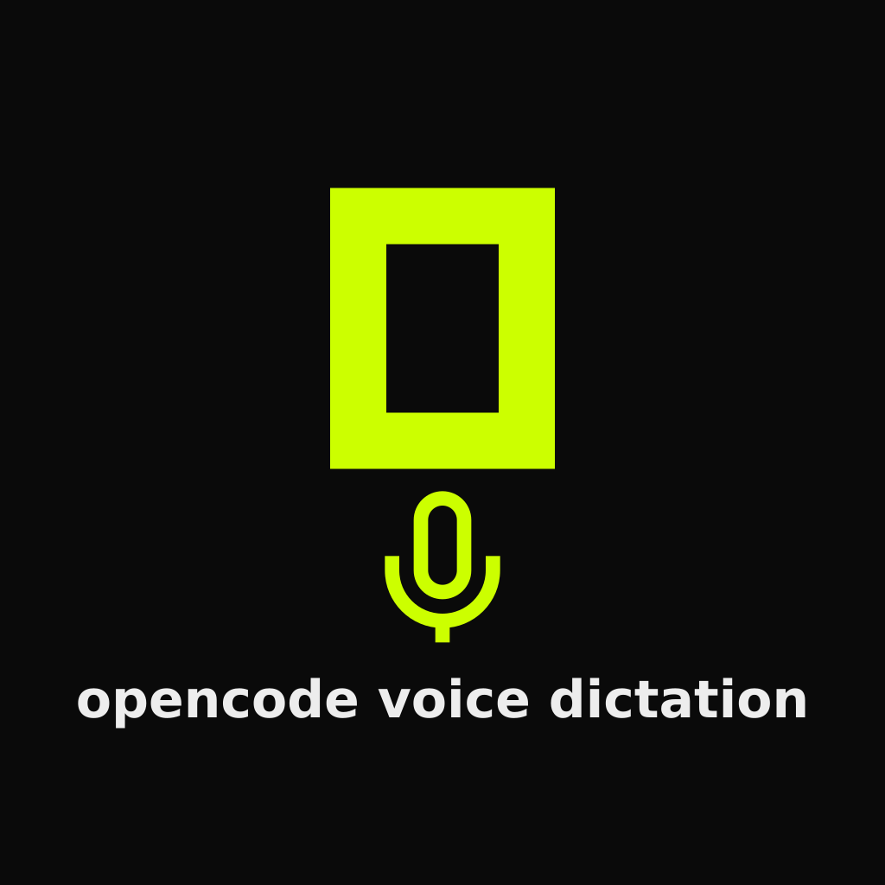

# 🚀 OpenCode WebUI Voice Input

[English](README.md) | [Русский](README.ru.md) | [简体中文](README.zh-CN.md)



> 为 OpenCode WebUI 提供语音输入：通过 Whisper（Groq API）在输入框旁加入麦克风按钮。

## 为什么做这个

我需要一种能在手机上直接给 OpenCode agent 口述输入的方法。Android 自带语音输入对这种场景不够好，而 OpenCode WebUI 本身也没有内置语音输入。

## 两种安装方式

现在支持两条路径，请根据你的使用环境选择其中一种：

| 方式 | 适合场景 | 工作方式 |
| --- | --- | --- |
| **A. Tampermonkey 用户脚本** | 桌面浏览器，以及支持 userscript/扩展的浏览器 | 在浏览器端注入麦克风 UI。STT 设置和 API key 保存在 userscript storage 中。**[安装用户脚本](https://raw.githubusercontent.com/idkwhodatis/opencode-webui-voice-input/master/dist/opencode-voice-dictation.user.js)** |
| **B. 服务端注入（Caddy + Bun + SQLite）** | **任何设备上的现代浏览器**，尤其适合不能安装 userscript/扩展的环境 | Caddy/Bun 把语音 UI 注入 OpenCode。API key 加密保存在 SQLite 中，主密钥使用独立的私有文件；可在设置网页配置 Groq 或自定义兼容接口。**[服务端部署说明](server/README.md)** |

**同一个 OpenCode origin 请只启用一种方式。** 不建议同时启用 Tampermonkey 和服务端注入。

## 功能

| 功能 | 说明 |
| --- | --- |
| 🎤 麦克风按钮 | 放在 Send 按钮旁边，点击开始/停止录音 |
| 🌍 语言 | 可指定语言，例如 `zh`、`en`、`ru`，或留空自动识别 |
| ⚡ 自动发送 | 转写完成后可自动发送给 agent；默认关闭 |
| 🧠 Whisper / Groq | 支持 `whisper-large-v3` / `whisper-large-v3-turbo` |
| 🌐 浏览器兼容性 | userscript 方案要求浏览器支持 userscript；服务端注入可用于任何支持标准麦克风/媒体 API 的现代浏览器和设备 |
| ✅ OpenCode V2 | 兼容当前 stable 和重命名后的 beta composer DOM |
| 🔄 自动更新 | Tampermonkey 版本通过 `@updateURL` 自动更新 |
| ⌨️ Ctrl+Space | 桌面端可用快捷键开始/停止录音 |

## ⚡ 方式 A — Tampermonkey

1. 安装 [Tampermonkey](https://www.tampermonkey.net/)。
2. 在 [console.groq.com/keys](https://console.groq.com/keys) 获取 Groq API key。
3. 打开 **[脚本安装链接](https://raw.githubusercontent.com/idkwhodatis/opencode-webui-voice-input/master/dist/opencode-voice-dictation.user.js)**，让 Tampermonkey 安装脚本。
4. **先限制脚本作用域。** 打开 Tampermonkey Dashboard → 此脚本 → **Settings** → **Includes/Excludes** → **User matches** → **Add**，只加入你自己的 OpenCode 地址，例如 `https://opencode.example.com/*`。
5. 默认匹配地址是保留的无效域名 `https://opencode.invalid/*`，因此安装后不会自动在任何真实网站运行。不要改成 `*://*/*` 或其他过宽规则。
6. 打开已授权的 OpenCode 页面，在 Tampermonkey 菜单中选择 **Set Groq API Key**。还可以设置模型、语言、Whisper Prompt、Temperature 和 Auto-Submit。
7. Auto-submit 默认 **关闭**。点击麦克风或按 Ctrl+Space 开始/停止；Cancel 会丢弃当前转写。切换 session 或替换 editor 时，当前录音/转写会被取消。

**localhost 指定端口：** Tampermonkey match rule 不区分端口。如果只想允许 `localhost:4096`，不要依赖 User match；在 **User includes** 中使用 `/^http:\/\/localhost:4096\/.*$/`，并按需替换端口。

麦克风权限要求 HTTPS 或 localhost，并需要浏览器授权。脚本只会在你主动开始录音时申请麦克风权限。

### 自定义 STT Endpoint

如果 Groq 在你的网络环境下无法直连，可以把 Tampermonkey 版本指向你自己的受信任 HTTPS 反向代理。例如 nginx：

```nginx
location / {
    proxy_pass https://api.groq.com:443;
    proxy_set_header Host api.groq.com;
}
```

然后在 Tampermonkey 菜单中选择 **Set STT Endpoint**，填入类似 `https://your-domain.com/openai/v1/audio/transcriptions` 的地址。

> 这个代理会接收到你的录音和 API key，因此只能使用你完全信任的代理。

### Temperature

Whisper 在静音或噪声下可能产生幻觉。**Set Temperature** 默认值为 `0`，范围 `0`–`1`；通常保持 `0` 最稳定。

### 语言识别不正确

如果输出语言和实际语音不一致，先把 **Whisper Prompt** 清空。Prompt 会对模型输出语言产生偏置；自动识别场景通常适合留空。

## 🖥️ 方式 B — 服务端注入（Caddy + Bun + SQLite）

如果你的 OpenCode 是自托管的，并且通过 Caddy 反向代理访问，同时希望语音输入能在**各种现代浏览器和设备上直接工作，而不需要客户端安装 userscript 或扩展**，推荐这一方式。

服务端版本会：

- 不 fork OpenCode，直接在反向代理链路中注入语音 UI；
- 在服务器上运行一个很小的 **Bun** 服务；
- 在 SQLite 中加密保存 STT API key，使用独立主密钥文件；设置网页只接受写入，不返回已保存的 key；
- 使用 **SQLite** 保存模型、语言、Whisper Prompt、Temperature 和 Auto-Submit；
- 提供同源 `/voice/` 设置页面和 REST API；
- OpenCode 的 streaming/WebSocket 等主要流量仍然直接走 OpenCode，不经过语音服务。

完整部署说明请看 **[server/README.md](server/README.md)**。里面包含 Caddy 路由配置、Bun/systemd 服务、API key 加密存储、SQLite 持久化、REST API、限流、超时和安全设计。

> 如果这个 origin 之前已经启用了 Tampermonkey 版本，请先禁用对应 userscript。

## 💬 支持与联系方式

👉 **[slaid098.dev/support](https://slaid098.dev/support)**

## 开发与验证

```sh
npm ci
npx playwright install chromium
npm run check
```

如果使用系统自带 Chromium，可以运行 `CHROMIUM_PATH=/path/to/chromium npm run check`。总检查会执行 lint、TypeScript 类型检查、dead-code 检查、Vitest 覆盖率测试、可复现 userscript 构建和 Chromium 浏览器测试。

浏览器测试覆盖桌面/窄屏按钮布局、composer 延迟出现和替换、session 切换、重复注入、录音 start/stop/cancel、麦克风拒绝、HTTP 401/429/5xx、网络/超时、rich-text append、Send/Stop 防误触、pagehide/refresh 清理和配置持久化等。

测试边界：自动化测试使用模拟麦克风和模拟 Groq endpoint，不会发起真实付费 API 请求。真实 Android Chrome、实际 Caddy 部署和真实设备麦克风仍建议部署后手动 smoke test。

[设计决策与作用域说明](docs/decisions/0008-scoped-v2-dictation.md)，[重命名 beta composer 的兼容说明](docs/decisions/0009-renamed-beta-composer.md)。原项目作者：[slaid098](https://github.com/slaid098/opencode-voice-dictation)。
